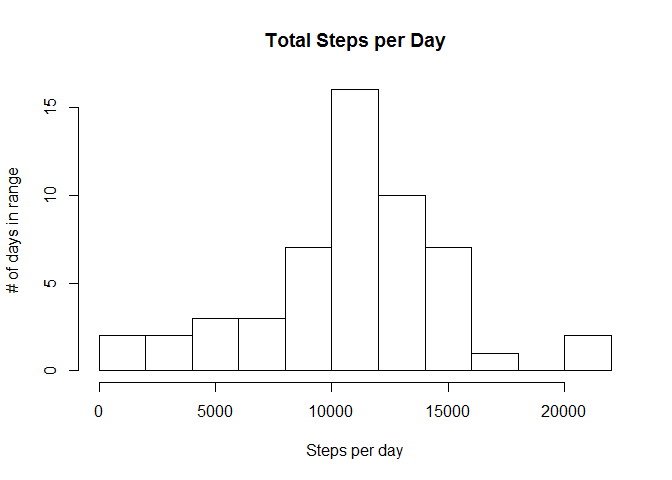
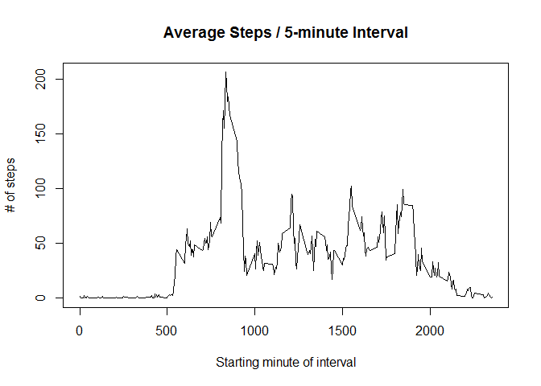
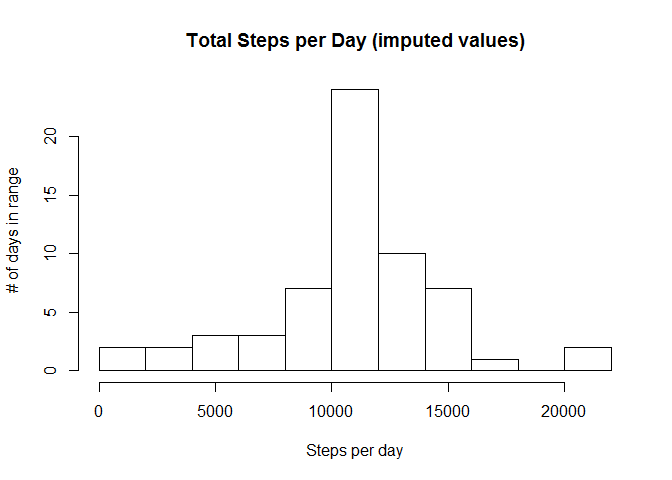
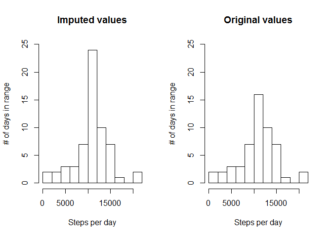
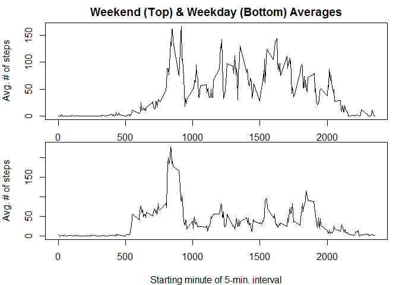

# Reproducible Research: Peer Assessment 1


## Loading and preprocessing the data

Unzipping the .csv file if it does not exist, then loading it into a data.frame.


```r
if (!exists("activity.csv")) {unzip("activity.zip")}
activity <- read.csv("activity.csv")
```

## What is mean total number of steps taken per day?

Creating a vector to store total steps taken on each day.


```r
day_totals <- rep(NA, length(unique(activity$date)))
names(day_totals) <- unique(activity$date)
```
Summing the values in $steps for each $date entry.


```r
for (i in unique(activity$date)) {
	day_totals[i] <- sum(activity$steps[activity$date == i])
}
```

Histogram of total steps taken per day.


```r
hist(day_totals, breaks = "FD", main = "Total Steps per Day", 
	xlab = "Steps per day", ylab = "# of days in range")
```

 

Taking the mean and median (ignoring the NAs).  


```r
mean(day_totals, na.rm = TRUE)
```

```
## [1] 10766.19
```

```r
median(day_totals, na.rm = TRUE)
```

```
## [1] 10765
```

## What is the average daily activity pattern?

Creating a data.frame to store interval data.


```r
interval_data <- data.frame(Interval = unique(activity$interval), 
					   Average = numeric(length(unique(activity$interval))))
```

Averaging the values in $steps for each $interval entry (ignoring NAs). 


```r
for (i in 1:nrow(interval_data)) {
	interval_data$Average[i] <- mean(activity$steps[activity$interval == interval_data$Interval[i]], na.rm = TRUE)
}
```

Plotting a time series of average values of 5-minute intervals across all days.


```r
with(interval_data, plot(x = Interval, y = Average, type = "l", 
					main = "Average Steps / 5-minute Interval", 
					xlab = "Starting minute of interval", 
					ylab = "# of steps"))
```

 

Finding the interval with the highest average steps.


```r
with(interval_data, Interval[Average == max(Average)])
```

```
## [1] 835
```

## Imputing missing values

Number of rows with missing data (/ NAs):


```r
summary(activity$steps)["NA's"]
```

```
## NA's 
## 2304
```

```r
# Or...
# sum(is.na(activity$steps))
```

Using the mean for that 5-minute interval to replace NAs...


```r
# 1st, copy the data.frame
imputed_activity <- activity
# Loop through copied data.frame, replacing NAs
for (i in 1:nrow(imputed_activity)) {
	if (is.na(imputed_activity$steps[i])) {
		# Find interval
		interval <- imputed_activity$interval[i]
		# Find average for interval
		avg <- interval_data$Average[interval_data$Interval == interval]
		# Fill in.
		imputed_activity$steps[i] <- avg
	}
}
```

Creating a vector to store total steps taken on each day.


```r
imputed_day_totals <- rep(NA, length(unique(imputed_activity$date)))
names(imputed_day_totals) <- unique(imputed_activity$date)
```

Summing the values in $steps for each $date entry.


```r
for (i in unique(imputed_activity$date)) {
	imputed_day_totals[i] <- sum(imputed_activity$steps[imputed_activity$date == i])
}
```

Histogram of total steps taken per day.


```r
hist(imputed_day_totals, breaks = "FD", 
	main = "Total Steps per Day (imputed values)", 
	xlab = "Steps per day", ylab = "# of days in range")
```

 

Comparing original and imputed:


```r
par(mfcol = c(1, 2))
hist(imputed_day_totals, breaks = "FD", ylim = c(0, 25),
	main = "Imputed values", 
	xlab = "Steps per day", ylab = "# of days in range")
hist(day_totals, breaks = "FD", ylim = c(0, 25),
	main = "Original values", 
	xlab = "Steps per day", ylab = "# of days in range")
```

 

Most of the histogram is the same, however the days that were omitted from the original histogram due to missing values are now added to the bar with the average values in the histogram with imputed numbers.  

Taking the mean and median (ignoring the NAs).  

```r
mean(imputed_day_totals, na.rm = TRUE)
```

```
## [1] 10766.19
```

```r
median(imputed_day_totals, na.rm = TRUE)
```

```
## [1] 10766.19
```

The median has changed; it is now equal to the mean.

If you impute the missing values by filling in the average values for that interval, you distort the distribution -- it is artificially concentrated at the mean.  

## Are there differences in activity patterns between weekdays and weekends?

Make a function to separate the days of the week into weekdays and weekends.


```r
weekend <- function(weekday) {
	if (weekday %in% c("Monday", "Tuesday", "Wednesday", "Thursday", "Friday")) {
		return("Weekday")
	} else if (weekday %in% c("Saturday", "Sunday")) {
		return("Weekend")
	} else {
		return(NA)
	}
}
```

Use the built-in function weekdays() to find the weekday-names of the dates, use them as inputs in the new weekend() function, and place that function's "Weekday"/"Weekend" output into a new column in the imputed_activity data.frame (as a factor).  


```r
imputed_activity$weekday <- as.factor(sapply(weekdays(as.Date(imputed_activity$date)), weekend))
```

Creating another data.frame to store the new interval data.


```r
imputed_interval_data <- data.frame(Interval = unique(imputed_activity$interval), 
							 Weekday_Average = numeric(length(unique(imputed_activity$interval))),
							 Weekend_Average = numeric(length(unique(imputed_activity$interval))))
```

Averaging the values in $steps for each $interval entry, separated by weekend status. 


```r
for (i in 1:nrow(imputed_interval_data)) {
	imputed_interval_data$Weekend_Average[i] <- mean(imputed_activity$steps[imputed_activity$interval == interval_data$Interval[i] & imputed_activity$weekday == "Weekend"])
	imputed_interval_data$Weekday_Average[i] <- mean(imputed_activity$steps[imputed_activity$interval == interval_data$Interval[i] & imputed_activity$weekday == "Weekday"])
}
```

Plotting two time series of average values of 5-minute intervals (across weekends and weekdays).


```r
par(mfcol = c(2, 1), mar = c(2, 4, 2, 1))
with(imputed_interval_data, plot(x = Interval, y = Weekend_Average, type = "l", 
						   main = "Weekend (Top) & Weekday (Bottom) Averages", 
						   ylab = "Avg. # of steps"))
par(mar = c(4, 4, 0, 1))
with(imputed_interval_data, plot(x = Interval, y = Weekday_Average, type = "l", main = "", 
						   xlab = "Starting minute of 5-min. interval", 
						   ylab = "Avg. # of steps"))
```

 

There is more movement earlier in the day on weekdays; otherwise weekends look more active.
